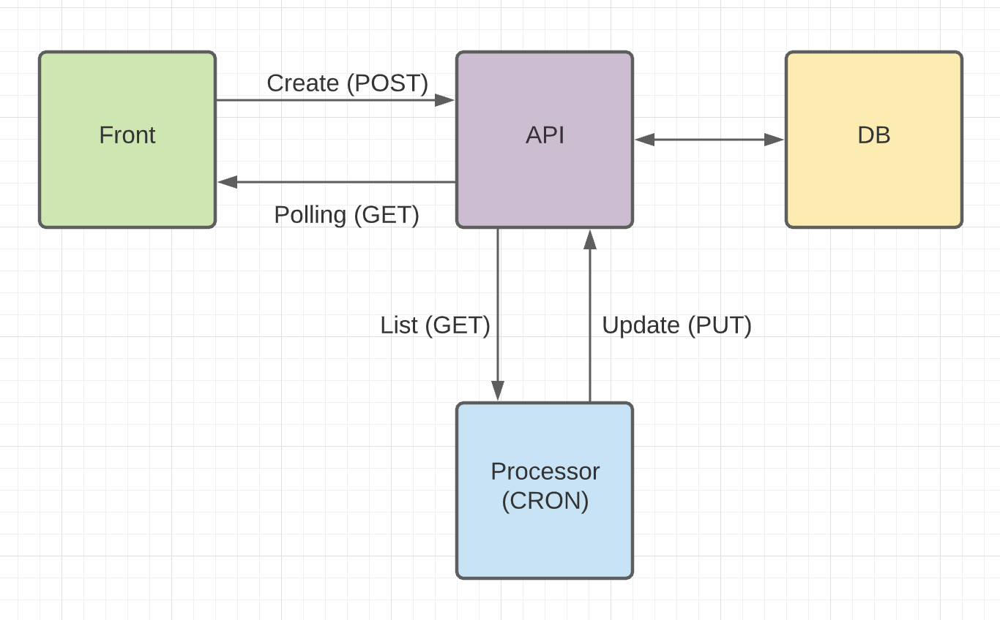

# Lancer le projet

Lancer le projet:
```
docker-compose up -d
```

Puis se connecter sur http://localhost:3000

# Archi du projet

## Schéma


L'api gère tout l'enregistrement des données, et le processor gère les calculs des factorisations. Le fornt récupère via polling l'état des calculs.

## Explication de l'archi de l'api
L'idée est de séparer le plus possible la logique métier de la logique technique. C'est pour ça que toute la validation des paramètres query params et du body est faite dans le Controller, tandis que la logique métier va dans la partie Handler.
De la même façon, on sépare les services techniques du formattage. Par exemple, dans le processor, on trouve le HttpService séparé du Http Client pour pouvoir changer le connector facilement. Ici, sans rien changer au code métier, on pourrait passer de got à axios très facilement.

## Afficher l’historique des résultats uniquement de l’utilisateur courant
On rajoute dans les appels API un customerId ou un email pour identifier le client qui fait le calcule. On enregitre cette donnée en base, et on la prend comme filtre dans la route List.

## Rendre le service robuste à des centaines de milliers de requêtes par minute
A la fois l'api et le processor peuvent être scale up pour prendre plus d'appels. Les deux problèmes sont:
- La DB (qui risque de ne pas tenir si trop d'appels)
- Différentes instances du processor peuvent calculer le même nombre et faire perdre du temps

En rajoutant un système de queuing (pubsub, kafka, SQS...), on peut simplifier ces deux limitations.

# Améliorations à faire
- Déploiement sur un serveur (heroku par exemple)
- Rajouter des tests unitaires
- Ajouter typescript sur le react
- Mettre un Docker de production sur le react
- Ajouter eslint & prettier
- Ajouter les pre commit hooks avec husky
